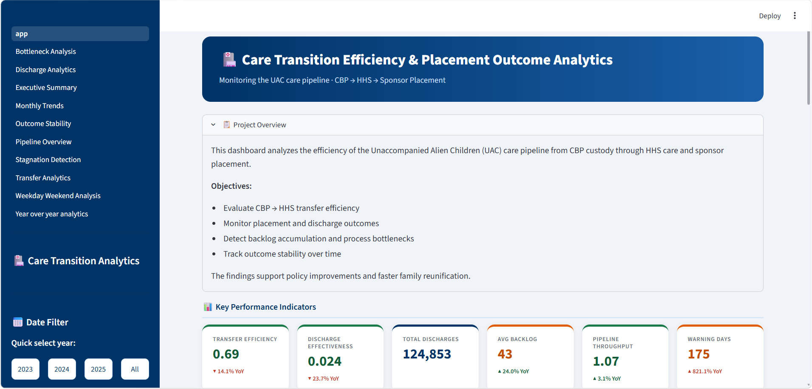
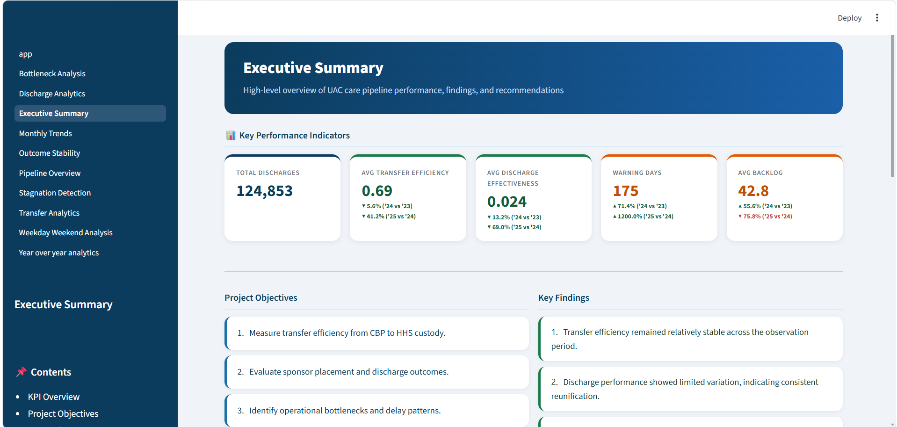
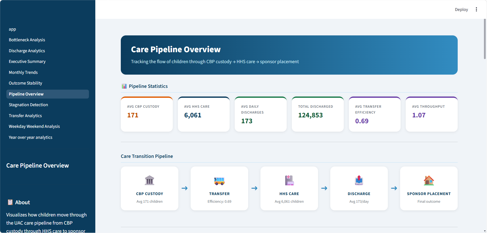
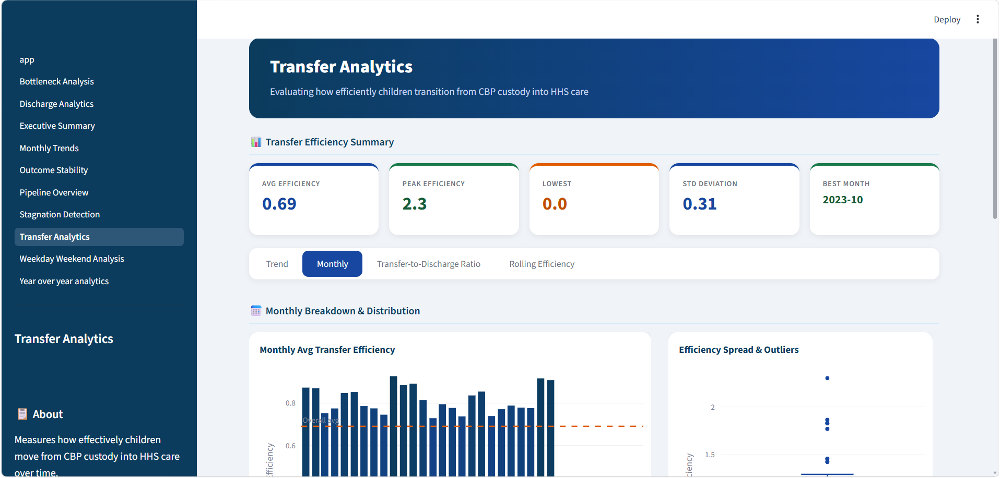
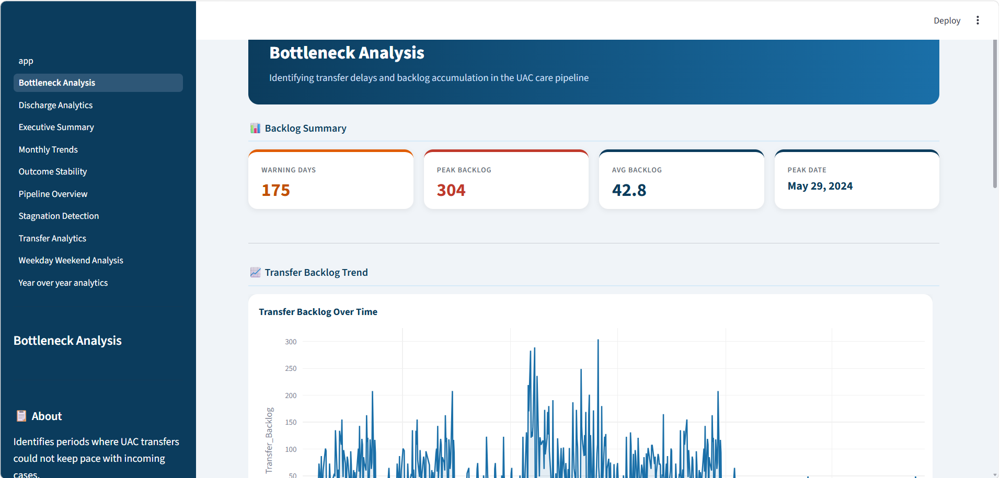
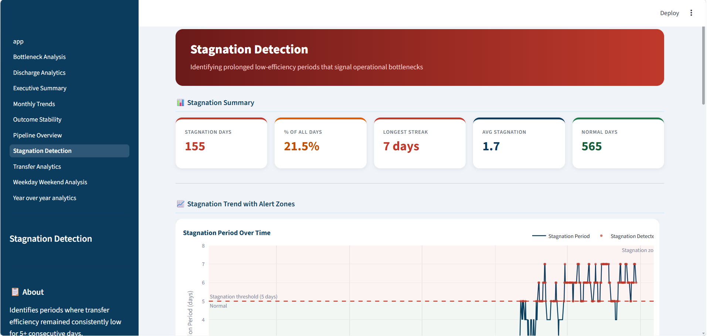
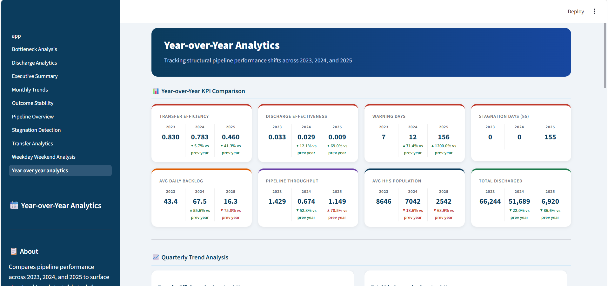

# Care Transition Efficiency & Placement Outcome Analytics

[](https://care-transition-efficiency-placement-outcome-new.streamlit.app/)

## Overview

Care Transition Efficiency & Placement Outcome Analytics is an interactive Streamlit dashboard developed to analyze the operational performance of the U.S. Unaccompanied Alien Children (UAC) care pipeline. The project transforms raw operational data into actionable KPIs, visual analytics, and statistical insights to support data-driven decision making.

---

## Live Dashboard

**Streamlit App:** https://care-transition-efficiency-placement-outcome-new.streamlit.app/

---

## GitHub Repository

**GitHub Project Link:** https://github.com/keshavs3/Care-Transition-Efficiency-Placement-Outcome-Analytics

---

## Objectives

- Monitor transfer efficiency across the care pipeline.
- Evaluate discharge effectiveness over time.
- Detect operational bottlenecks and stagnation periods.
- Compare yearly operational performance.
- Generate evidence-based recommendations for policymakers.

---

# Dashboard Modules

## Modules and its Description :

- **Executive Summary        -**  High-level KPI overview and recommendations
- **Care Pipeline Overview   -**  Sankey Diagram and throughput analysis
- **Transfer Analytics       -**  Transfer efficiency trends and monthly analysis
- **Discharge Analytics      -**  Discharge effectiveness analysis
- **Bottleneck Analysis      -**  Transfer backlog detection
- **Stagnation Detection     -**  Alert generation and stagnation periods
- **Outcome Stability        -**  Rolling performance analysis
- **Monthly Trends           -**  Seasonal trend analysis
- **Weekday vs Weekend       -**  Operational comparison
- **Year-over-Year Analytics -**  Annual KPI comparison

---

## Key Performance Indicators

- Transfer Efficiency
- Discharge Effectiveness
- Pipeline Throughput
- Average Daily Backlog
- Average HHS Population
- Total Discharged

---

## Technologies Used

- Python
- Streamlit
- Pandas
- NumPy
- Plotly
- Pathlib
- Statsmodels
- Git
- GitHub

---

# Dashboard Preview
An interactive Streamlit dashboard that visualizes UAC care pipeline performance through operational KPIs, trends, and analytics to support data-driven decision-making.

## App Page
The landing page providing a centralized overview of the project with intuitive navigation to all analytics modules.



---

## Executive Summary
Presents key performance indicators, executive insights, and high-level recommendations for quick decision-making.



---

## Care Pipeline Overview
Visualizes the end-to-end UAC care pipeline using a Sankey diagram, highlighting child flow and overall throughput.



---

## Transfer Analytics
Analyzes transfer efficiency through trend analysis, monthly performance, distribution, and operational metrics.



---

## Discharge Analytics
Examines discharge effectiveness, discharge volumes, and placement outcomes to evaluate system performance.


---

## Bottleneck Analysis
Identifies periods of backlog accumulation, operational bottlenecks, and peak congestion within the care pipeline.



---

## Stagnation Detection
Detects prolonged periods of low operational activity and highlights potential risks through automated stagnation alerts.



---
## Outcome Stability
Evaluates the consistency of discharge performance using rolling averages and stability trend analysis.


---

## Year-over-Year Analysis
Compares annual performance across key operational KPIs to identify long-term trends, improvements, and emerging risks.


---

## Research Paper

The repository also includes a complete research paper containing:

- Exploratory Data Analysis
- KPI Development
- Statistical Evaluation
- Dashboard Design
- Discussion
- Recommendations
- Executive Summary for Government Stakeholders

---

## Installation

Clone the repository

```bash
git clone https://github.com/keshavs3/Care-Transition-Efficiency-Placement-Outcome-Analytics.git
```

Install dependencies

```bash
pip install -r requirements.txt
```

Run

```bash
streamlit run dashboards/app.py
```

---

## Contact

**Keshav Sinha**

**GitHub:** https://github.com/keshavs3